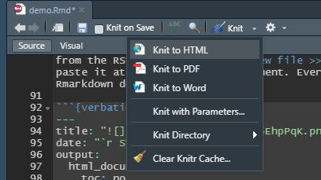
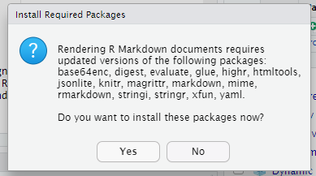

# Dynamic reports demonstration{.tabset}

## Introduction

This is our dynamic report training resource. The main objective of this training resource is to demonstrate how to build a report like this one. In this session, we will work through the report step-by-step. It's interactive - so do please ask questions, or for extra clarification if anything isn't as clear as you'd like it to be. It's also very useful for everyone in the group if you can reflect on how this demonstration report might be adapted to suit your needs.

Most of this demonstration is just about following-along. It's useful to try and switch between the code pane and the viewer pane to see how the report works. You might find it helpful to minimise the Console and Environment panes for this tutorial as they're less important at this stage.

### What to do if things go wrong?
There are lots of minor problems that we might encounter while working through this report. First, this is *normal and to be expected*. Please don't worry if things don't work first time - we will be able to work through any problems that you might encounter and hopefully resolve them fairly easily. Second, we'll give some advice below about good strategies for solving problems - this is a key part of the learning journey in this field.

### What's the point of this demonstration?

This demonstration will show you how to build simple dynamic reports using R and RMarkdown. To give a lightning-speed overview:

1. We'll load some data into R and tidy it
```{r pre-setup, message=FALSE, warning=FALSE, echo=F}
install.packages(setdiff("pacman", rownames(installed.packages())))
library("pacman")
p_load(tidyr,readr,DiagrammeR,ggplot2,dplyr,lubridate,NHSRplotthedots,readxl, stringr)
# avoiding tidyverse as loading in RStudio Cloud potentially runs out of memory 
```
```{r pre-load, message=FALSE, warning=FALSE, echo=T}
demo <- read_csv("data/data.csv") %>% mutate(date=dmy(date))
```
2. We'll use that data to produce dynamic text, that updates as the data changes, formatted using RMarkdown:

+ Our data is `r ncol(demo)` columns by `r nrow(demo)` rows
+ The column headings are **`r colnames(demo)`**
+ The first date in our data is `r min(demo$date)`, and the last date is `r max(demo$date)`. 

3. We'll display tables based on that data, including summaries and other measures of use across health, care, and housing
```{r pre-table, message=FALSE, warning=FALSE, echo=T}
knitr::kable(head(demo))
```
4. We'll draw graphs with that data and show how they can fit into your report
```{r pre-graph, message=FALSE, warning=FALSE, echo=T, fig.height=1, fig.width=3}
ggplot(demo) +
  geom_line(aes(x=date, y=count1)) +
  xlab("Date") + ylab("Count 1")
  
```

5. Finally, we'll end with some tips on possible next steps for you


## Getting set-up
First thing first: we will work through knitting this document at the start of the session. We definitely don't want our end users to see our RMarkdown code. So the .Rmd file that we are working on needs to be converted into a suitable output format. We call that conversion *knitting* (after the R package `knitr` that manages the conversion). To knit your file, you can either:

- select the Knit option from the menu at the top of the code pane. You can select any of the output formats, although I'd suggest sticking with .html (webpage) while working through the demo.

```{r echo=F, out.width="300px"}

```

- alternatively, press `ctrl+shift+k` while your cursor is in the code pane to knit to the last used format

Knitting is controlled by the preamble at the head of .Rmd. For now, I'll suggest that you skip trying to figure it all out in favour of spending our time on some of the more interesting areas of this demonstration. I'll give more details about setting up your Rmarkdown document at the end of this document in the **More details** section.

The first time that you knit your document in RStudio Cloud, you may get a warning about required packages. Just agree to this, as you'll need the packages to knit your document properly.

```{r echo=F, out.width="300px"}

```

### Getting R ready
Once you've got the header in place, we need to do a tiny bit of setting R up properly. R uses packages, which are plug-ins that offer useful functions. We need to add these packages to R to help us do some of the tasks in this demonstration. We've actually added them already in the first few lines of this report. Let's have a look at this code, which includes some explanatory comments:

```{r setup, echo=TRUE, eval=F, warning = FALSE, message=FALSE}
# if pacman is missing, installs pacman, which helps us manage packages
install.packages(setdiff("pacman", rownames(installed.packages())))

# loads pacman
library("pacman")

#loads required packages
p_load(tidyr,readr,DiagrammeR,ggplot2,dplyr,lubridate,NHSRplotthedots,readxl, stringr)

# Comments are useful - add comments as you work! R comments start with a #, comments in RMarkdown start <!-- and end -->

```

We load several packages (link to eventual NHS-R statement on tools and packages) here to help us do some useful work with our data. These are all *very* useful for health and care projects, so we'll briefly introduce them here:

+ [tidyverse](https://www.tidyverse.org/) - this is a large ecosystem of tools designed for data science. Specifically in this demonstration, we use tidyr, readr, DiagrammeR, ggplot2, stringr, readxl, and dplyr.
+ [lubridate](https://lubridate.tidyverse.org/) - helps with handling dates and times
+ [NHSRplotthedots](https://github.com/nhs-r-community/NHSRplotthedots)  - NHS-R community tool for making XmR charts


## Using Rmarkdown

[Rmarkdown](http://rmarkdown.rstudio.com) is a simple markup language. You might have used it before without really knowing what it was called. If you've ever posted on a Wordpress site or web forum with basic text formatting options available, the chances are that you've already done at least a tiny bit of markdown. Just to give you an example, surrounding a word with asterisks - like ```*italics*``` formats it in *italics*. Pairs of asterisks either side of the word formats that word - like ```**bold**``` - formats the text as **bold**. And so on. 

This kind of very basic formatting is known as Markdown. While it's simple, it's usually sufficient to allow the production of neat and clear documents that are easy to ready. Rmarkdown is just Markdown with a few extras to allow you to embed R code directly into the text that you're writing. That R code allows you to do more-or-less any data analysis that you might like and include the results in your markdown-formatted document. There's a quick reference sheet at the foot of this section.

### RMarkdown quick reference

*italics*: ```*italics*```

**bold**: ```**bold**```

----

Add a horizontal break: ```----``` (so at least 4 dashes, with new lines either side)

----

[links](https://google.com): ```[links](https://google.com)```

Heading levels

```
# Level 1
## Level 2
### Level 3
...

- dashes at the start of lines make bullet-points
- like so
```
- dashes at the start of lines make bullet-points
- like so

```
1. Numbers at the start of lines make numbered lists
2. like so
```
1. Numbers at the start of lines make numbered lists
2. Like so

You can also add images easily in RMarkdown, and you can easily find [guidance online about how to do this](https://www.earthdatascience.org/courses/earth-analytics/document-your-science/add-images-to-rmarkdown-report/). I'd advise you not to use RMarkdown for image handling, because it can cause problems (particularly when you're using images hosted on the web) when you `knit` your project to .pdf and .docx formats. The R command `include_graphics()` is a much better option, and we'll cover its use in the graphs section.

### Exercises

1. Change THIS TEXT to bold, and THIS TEXT to italic
2. Add some bullet points below here describing your morning:
+ this morning, I...

Do have a look at the Rmarkdown in the code pane, and feel free to play around with it. Once you've had a look at some of the Rmarkdown in practice, we're ready to move on to get some data.

## Getting data

Once we've got a sense of how we're going to write our report using RMarkdown, it's time to start thinking about the data that we are going to use to make our report update. Luckily, getting data into R is easy. Instead of opening a data file directly (as we might when using Excel), and then inspecting and analysing it, we instead load all the data in that file into R. 

I've provided some demo data, which you can see in the file pane (`data.csv`). The format of this data is pretty simple: it gives three different values each measured on a single date as shown below. This might be similar to the kind of data that you'd see in your work - like admissions figures, service engagement statistics, or inquiry measures.

| date       | count1 | count2 | count3 |
| ---------- |:------:|:------:|:------:|
| 01/05/2022 |   11   |   93   |   82   |
| 02/05/2022 |   15   |   114  |   99   | 
| 03/05/2022 |   ...  |   ...  |   ...  |

We load the data using the following command:

```{r get data, echo=TRUE, eval=TRUE,warning = FALSE, message=FALSE}
demo <- read_csv("data/data.csv")
```
Definitely worth us pausing here to explain what all this means. Usually in R, you do things by applying *commands* to objects like data. To break this command down into steps:

+ ```read_csv``` is the main command, which opens a .csv data file, and reads its contents
+ ```data/data.csv``` is where we tell `read.csv` which .csv file to open by specifying the file's name and path
+ ```<-``` then assigns the data that `read_csv` pulls out of the file to...
+ ```demo``` - the *tibble* that contains our data. We'll explain what a tibble is below, but for now you can just think of it as the way that R stores data

If you look at the code pane, you'll see that this R command is wrapped-up in backticks, with a lot of options in {curly brackets}. These backticks are the way that we mark our R code, thus telling RStudio Cloud to interpret it as R, rather than RMarkdown. We call these sections of code ```chunks```. In what's ahead, one of the most common problems come from chunks, and so one of the first things to check if a command doesn't work as expected is that it's properly in place in a chunk.

When I first started using R, I don't think that I'd ever used the backtick (`` `r '\x60'` ``) key before. You can usually find it at the extreme top left of most keyboards, often below the `Escape` key. Backticks are definitely different from the apostrophe ('), and it's vitally important to not get the two confused when you're working with R.

<!-- Please ignore the horrible messing about with \x60r etc that I've done in the paragraph above to get backticks to display properly in RMarkdown. This isn't something that you're likely to have to do - unless you end up writing your own RMarkdown tutorial at some point in the future...-->

There are more details about chunk set-up in the **More details** section.

Because there are lots of different types of data out there, there are lots of ways of loading data into R. ```read_csv``` is the most commonly-used one, because .csv files - **c**omma **s**eparated **v**alues - are widely used to share data. The other main function used to load data is readr's ```read_excel```, which works similarly to ```read_csv```. 

Let's try a couple of tasks now to help you get the hang of loading data. There are two empty R chunks below. Can you fill in the gaps to make the right thing happen?

<!-- do more handholding for these exercises -->

### Data exercise 1
Can you load the data from the data.csv file into a tibble called ```demo2```?

```{r data ex1, echo=TRUE, eval=TRUE,warning = FALSE, message=FALSE}
# Write your code below. Hint: the structure of the command will be the same as the chunk above - which went:
demo <- read_csv("data/data.csv")

# but the name of the tibble will be different this time


```

### Data exercise 2
Can you load the data from the demo 2.xlsx file into the ```demo2``` tibble using read_excel?

```{r data ex2, echo=TRUE, eval=TRUE,warning = FALSE, message=FALSE}
# Write your code below. This will overwrite the contents of demo2 with new data. I've included the previous line of code here to help

demo2 <- read_csv("data/data.csv")

# Hint: whenever you're in a chunk, you can get help on a command by typing a question mark, then the name of the command, then ctrl-enter. For example, you can type ?read_excel on a new line for help with reading .xlsx files.
```

Once we've loaded our data, we can use it in other commands. One of the most useful commands is `head()`, which lets us look at the first few rows of a data object:

```{r inspect data 1, echo=TRUE, eval=TRUE, warning = FALSE, message=FALSE}
head(demo)
```

### Data exercise 3
Can you look at the head of your `demo2` tibble? How do demo and demo2 differ?

```{r data ex3, echo=TRUE, eval=TRUE,warning = FALSE, message=FALSE}
# Write your code in the line below. Again, I've included the previous command as a starting point for you

head(demo)

```

### A note on tibbles
From the .csv file, we have converted the data into a *tibble*, which is the name for the data structure used by the package ```tidyverse```. In this tibble (called ```demo```), each row contains four columns. One holds date, and the remaining three hold of counts of some imagined values from those dates. 

There's potentially lots to say about tibbles. If this is new territory for you, the [relevant chapter in *R for Data Science*](https://r4ds.had.co.nz/tibbles.html) is a great place to start. Or if you'd prefer something much more terse, the high-level introduction on the [tidyverse site](https://tibble.tidyverse.org/) would be good too.

### Back to our data

Once we've loaded our data, we can begin to do all kinds of interesting things with it. Most of that will have to wait for the section after next - we'll need to do some data tidying first before we can do most of the really interesting work. But just to whet your appetite, here are a couple of examples of operations that we can do on our data.

A common finding that we often need to report in data-driven work is about length. Just how many dates do we have data for? Happily, this is one of the easiest things to discover using R, because we can count the total number of rows in our tibble using the the `nrow()` command:

```{r inspect data 2, echo=TRUE, eval=TRUE, warning = FALSE, message=FALSE}
nrow(demo)
```
### Data exercise 4
Does `demo2` have the same number of rows as `demo`?

```{r data ex4, echo=TRUE, eval=TRUE,warning = FALSE, message=FALSE}
# Write your code in the line below

```


Or we can pull out the column headings with:
```{r inspect data 3, echo=TRUE, eval=TRUE, warning = FALSE, message=FALSE}
colnames(demo)
```

### Data exercise 5
Again, does `demo2` have the same column headings as `demo`?

```{r data ex5, echo=TRUE, eval=TRUE,warning = FALSE, message=FALSE}
# Write your code in the line below

```
Note that in the couple of examples above, we've just asked R to show us the number of rows, and the column names. We can also save these findings, which we might do if we want to use them later for another purpose. Just for instance, we can make a new variable *demo_length* containing the number of rows in our data with:

```{r inspect data 4, echo=TRUE, eval=TRUE, warning = FALSE, message=FALSE}
demo_length <- nrow(demo)
```

And we can refer back to the value of *demo_length* whenever we like:
```{r inspect data 5, echo=TRUE, eval=TRUE, warning = FALSE, message=FALSE}
demo_length
```

Or do things to that value - like multiplying it by five:
```{r inspect data 6, echo=TRUE, eval=TRUE, warning = FALSE, message=FALSE}
demo_length * 5
```

### Data exercise 6
Can you calculate and display the difference in length between `demo` and `demo2`?

```{r data ex6, echo=TRUE, eval=TRUE,warning = FALSE, message=FALSE}
# Write your code in the line below

```

We can also create new variables from more complicated operations on our original tibble. For instance, we can extract a whole column using ```tibble$column```, and then add all the entries in that variable together using ```sum()```:

```{r inspect data 7, echo=TRUE, eval=TRUE, warning = FALSE, message=FALSE}
sum_count3 <- sum(demo$count3)
sum_count3
```
I think that's enough demonstrating the basics of loading data for now. There's one an important problem with our `demo` tibble: our dates aren't proper dates yet. `read_csv` doesn't know that the values in the date column actually are dates. We can tell that by looking `head(demo)`, which shows that the type of data in the `date` column is `<<chr>>`. This stands for `character`, which is the way that R refers to text values. We definitely want those values to be stored properly as dates, and doing that conversion will be the next part of this demonstration.

## Cleaning data

Time for another R chunk:

```{r clean up data, echo=TRUE, eval=TRUE,warning = FALSE, message=FALSE}
demo_dates <- demo %>% mutate(date = dmy(date))
```

There's a bit to unpack here. It makes most sense (to my mind, at least) to read this code backwards. From right to left, then:

+ ```dmy(date)```  is a lubridate command which takes whatever's in the bracket, and tries to convert it into a proper date. It works by assuming that it'll be a day value (d), followed by a month (m), followed by a year (y). There are also related commands like ```ymd()``` to be used when the dates given in our data are formatted differently.
+ `mutate(date =...)` takes the result of the `dmy()` above, and uses it in a command named `mutate`. `mutate` makes new columns in tibbles from existing columns. Here, we tell `mutate` to make a new column called `date` by taking the result of the `dmy(date)` above.
+ ` %>%` [the pipe!](https://r4ds.had.co.nz/pipes.html) This is a way of chaining commands together. In this case, writing `demo %>% mutate...` tells R to take the demo tibble, and do the mutate command to it. The advantage here is that we can string several `%>%`s together, to do many operations in sequence on some set of data.
+ finally, we assign the modified demo tibble to a new tibble `demo_dates` using `<-`.

That simple exercise introduces several new concepts, so we'll pause here to work through some exercises to reinforce the new material.

### Exercise 1

Let's take our `demo2` tibble, and inspect its `head()` to see what type of data is stored in it to find out whether or not we'll need to modify the date column in the same way:

```{r clean ex 1, echo=TRUE, eval=TRUE,warning = FALSE, message=FALSE}

```

### Other major clean-ups

#### Missing and incorrect data

Sometimes we'll have missing or anomalous data in the files that we load into R. This can cause all kinds of subtle problems in R. Our `demo` tibble (and derivatives like `demo_dates` etc) have no missing data, so to demonstrate we'll load some new, faulty data into `demo3`, and try to tidy it up. The first part of this should be very familiar - we load data using `read_csv()`, then mutate the date column to give us proper dates. We then look at the `head()` of the data:

```{r clean 2, echo=TRUE, eval=TRUE,warning = FALSE, message=FALSE}
demo3 <- read_csv("data/data3.csv") %>% mutate(date = dmy(date)) 
head(demo3)
```
Right away we can see a few problems:

- there's missing data in the count1 column (`NA`)
- the count2 column is `<chr>`, rather than `<dbl>` - *double* is R's way of referring to numeric data
- the title of the last column seems to have gotten scrambled

Let's deal with the missing data. Let's see what we're dealing with:

```{r clean 3, echo=TRUE, eval=TRUE,warning = FALSE, message=FALSE}
demo3 %>% filter(if_any(c(date, count1, count2, cnont3), ~ is.na(.)))

```
Don't worry too much about the details of the code above. We're just looking through `demo3` using the `filter` command, which shows rows that match some condition. We tell `filter` to look across the date, count1, count2, and count3 columns using `if_any`, and then specify that `filter` should look for any rows with missing data using `is.na`. We could also do this one column at a time:

```{r clean 4, echo=TRUE, eval=TRUE,warning = FALSE, message=FALSE}
demo3 %>% filter(is.na(date))

```

##### Exercise 2

Using the code above as a starting point, can you confirm the missing data in count1 and count2?

```{r clean ex 2, echo=TRUE, eval=TRUE,warning = FALSE, message=FALSE}
# Add your code below

```
How about finding non-number values in count2?
```{r clean 5, echo=TRUE, eval=TRUE,warning = FALSE, message=FALSE}
demo3 %>% filter(!stringr::str_detect(count2,"^\\s*[0-9]*\\s*$"))
```

Or converting count2 to numeric. This will just force conversation, so we'll change that "None" into a proper `NA`:

```{r clean 6, echo=TRUE, eval=TRUE,warning = FALSE, message=FALSE}
demo3 %>% mutate(count2 = as.numeric(count2))
```

#### Renaming columns
Let's change that `cnont3` into something more seemly - like `count3`. I'll give you some tips, and then leave you to do the actual renaming as an exercise. We'll use the command `rename()` to do the renaming. It's a pretty simple command, so rather than explain it fully, let me refer you to the [manual page](https://dplyr.tidyverse.org/reference/rename.html) - or you can run `?rename()` in the R chunk below:


```{r clean ex 3, echo=TRUE, eval=TRUE,warning = FALSE, message=FALSE}
# Add your code below - I've included head(demo3) afterwards so that you can check the renaming has worked properly.


head(demo3)
```
Now that we have some data loaded and cleaned up, we're ready to use it to start writing our report.

## Updating text

Here's the most important point in the whole of this demonstration: **we can make our RMarkdown text change depending on the data that we feed to R**. Let's start with a group of examples that show how we might report from our `demo_dates` tibble from earlier:

---

<!-- Note that we can write comments in our RMarkdown file which won't be displayed in the output. This is very helpful to remind yourself - or tell others - exactly what's going on in your code. The square brackets in demo[1,3] allow us to pull out data from specified places in a tibble. The general syntax is [row,column]. -->

### Text showing data from `r month(min(demo_dates$date), label = T, abbr=F)` - `r month(max(demo_dates$date), label = T, abbr=F)` `r year(min(demo_dates$date))`

+ we have data from `r nrow(demo_dates)` days
+ we have a total of `r sum(demo_dates$count1)` count1s
+ the biggest value in count3 is `r max(demo$count3)`. 
+ on the first day for which we have data, the count2 was `r demo_dates %>% filter(date == max(date)) %>% select(count2) %>% as.numeric`
+ the average of count3 was `r round(mean(demo_dates$count3), 1)`

---

That might look a bit unimpressive, given all the work that we've done to get here. But now let's see what happens when we run exactly the same commands but change the data. Behind the scenes, there are a couple of R chunks here that change the contents of `demo_dates`. We don't need to show these in this report - but do feel free to look at the code pane to see how this works:

```{r update 1, echo=FALSE, eval=TRUE,warning = FALSE, message=FALSE}
# backup the demo_dates tibble into demo_dates_old, load new data into the demo_dates tibble, and make sure the dates are correct
demo_dates_old <- demo_dates
demo_dates <- read_csv("data/data4.csv") %>% mutate(date=dmy(date))

```

---

### Text showing data from `r month(min(demo_dates$date), label = T, abbr=F)` - `r month(max(demo_dates$date), label = T, abbr=F)` `r year(min(demo_dates$date))`

+ we have data from `r nrow(demo_dates)` days
+ we have a total of `r sum(demo_dates$count1)` count1s
+ the biggest value in count3 is `r max(demo$count3)`. 
+ on the first day for which we have data, the count2 was `r demo_dates %>% filter(date == max(date)) %>% select(count2) %>% as.numeric`
+ the average of count3 was `r round(mean(demo_dates$count3), 1)`

```{r update 2, echo=FALSE, eval=TRUE,warning = FALSE, message=FALSE}
# restoring the original demo_dates tibble, and removing demo_dates_old
demo_dates <- demo_dates_old
rm(demo_dates_old)
```

---

The RMarkdown for those two example sections above is *exactly* the same. All that's changed is the data - as might happen when you take your dynamic report and set it to run on new data. No manual updating at all!

### How does this work?

We run little snippets of R, right in the RMarkdown text. The function of those snippets is to query the data that we've set up in the previous two sections of this demonstration, and then pass the results into RMarkdown, so that the results appear as inline text. We can apply formatting etc to those results as if they were any other text written in RMarkdown.  

If you look at the code pane, you'll notice a slightly different mini-chunk structure that we use for these R snippets. The snippets themselves are wrapped in single backticks, with a general format of `` `r '\x60r command()\x60'` ``. This tells R/Rmarkdown to run the command, but pass the output to RMarkdown which displays the output as if it were written inline.

Let's go through the example above to see how the commands work:

<!-- trying to get RMarkdown to actually display backticks is a faff that requires a workaround using \x60 as a synonym for the backtick symbol - so do please excuse the unintelligible symbols in this section-->

+ we have one date per row. So counting the rows of `demo_dates` tells us the total number of days. We can do this using the expression `` `r '\x60r nrow(demo_dates)\x60'` ``.
+ the command `sum(demo_dates$count1)` adds all the entries in the count1 column
    + **reminder**: using `$` lets us select a column from our tibble
+ `max(demo_dates$count3)` gives us the maximum value in count3
+ the value of count2 on the first day of the range is given by (`r demo_dates %>% filter(date == min(date)) %>% select(count2) %>% as.numeric`)
    + **reminder**: we use the `%>%` pipe to chain commands together. 
    + From left to right, we take the `demo_dates` tibble
    + then use the `dplyr::filter` command to find the row where the date is equal to the `min(date)`
    + then use `dplyr::select(count2)` to pick out the value of count2 on that date
    + then convert the result from a 1x1 tibble into a number using `as.numeric()`
+ the mean (average) of count3 was `round(mean(demo_dates$count3), 1)`
    + we use `round()` to give us our average to 1 decimal place. Otherwise R will report is as `r mean(demo_dates$count3)`. The extreme precision here is commendable, but misguided!
    + finally, in the header, we have a little group of commands to report the month and year that our data covers:
    - `` `r '\x60r month(min(demo_dates$date), label = T, abbr=F)\x60'` `` takes the earliest date `min(demo_dates$date)`, and then extracts the full month using `month( ..., label = T, abbr = F)`. There are lots of options for displaying the names of months, so I'd encourage you to run `?month()` to find out about them
    - `` `r '\x60r month(max(demo_dates$date), label = T, abbr=F)\x60'` `` does the same, but for the last date in the range
    - `` `r '\x60r year(min(demo_dates$date))\x60'` `` extracts the year in a similar way

I'll say it again: **change the data, and all this stuff will update automatically**. Change the data, re-knit the report, and bask in the glory of a updated report - go on, try it!

### Exercise 1

As a refresher, let's have a look at the first few rows of the demo tibble using ```head()```, and also print out the total number of rows using ```nrow(demo_dates)```:

```{r text ex 1, echo=TRUE, eval=TRUE,warning = FALSE, message=FALSE}
head(demo_dates)
nrow(demo_dates)
```

This data will change as the data in the `data.csv` file changes. You can show yourself how this works as follows:

1. First, edit the `data.csv` file. To do this, click on the `data` folder in the `Files` pane, then click on the `data.csv` file and select `View File`. This should open the data file in the code pane. 
2. Now delete a couple of rows of your choice, before saving and closing the file.
3. Now re-knit the document again. The data now has `r nrow(demo_dates)` rows, rather than the original 68 rows.

### Exercise 2
This time, let's try formatting the output of our R snippets. I've provided a list of unformatted code below. Can you fit this into a more report-y format - like integrating it into a paragraph of text, or adding bold, italics, headings, or whatever takes your fancy?

<!-- here are the example R snippets for you -->

Sum count3 on Mondays in our range: `r demo_dates %>% filter(wday(demo_dates$date) == 2) %>% select(count3) %>% sum()`

Number of days where count1 is 30 or more, and count2 is 70 or less: `r demo_dates %>% filter(count1 >= 30 & count2 <= 70) %>% nrow()`

Number of days where count1 is greater than count3, but smaller than count2: `r demo_dates %>% filter(count1 > count3 && count1 < count2) %>% nrow()` 

Count 2 was highest on this day of the week: `r demo_dates %>% filter(count2==max(count2)) %>% select(date) %>% unlist() %>% as.Date(origin="1970-01-01") %>% lubridate::wday(label=T, abbr=F)`


<!-- write your paragraph below -->

### Exercise 3
Taking those commands from the above, can you tweak the R code snippets to that we have a nice paragraph where we:
+ find out what the sum of count3 is on Tuesdays?
+ find out how many days count 1 is 30 or more, and count2 is 90 or less?
+ find the number of days where count 1 is greater than count 2, but smaller than count 3?
+ find which day of the week count 3 was highest?

<!-- write your paragraph below -->


### Exercise 4
Can you write a simple new command, and include it in a line or two of explanatory text? Some hints:
- make sure that you wrap your R code properly: `` `r '\x60r someCommand(someData)\x60'` ``
- you might like to try `mean(), min(), max(), sum()` on one of the columns using `$`
- you do something more ambitious using `select() and filter()`
- remember to try looking at the manual pages using `?command` if you get stuck

## Data tables

The raw output from tibbles (like when we use `head(demo_dates)`) that we've been using so far is very useful. But it looks pretty nasty. Ideally, we'd like to be able to format this text so that it fits into our report properly.

### Using knitr::kable

Sometimes our reports need to contain larger chunks of data than are comfortable to manage using inline text. The most obvious example is the data table. We have some R commands that are extremely helpful for writing data tables in reports. `knitr::kable` is the most useful of all, because it allows us to produce nicely formatted tables with the very minimum of fooling about. So the first few rows of our demo tibble look like this:

```{r data table 1, echo=TRUE, eval=TRUE,warning = FALSE, message=FALSE}
knitr::kable(head(demo_dates))
```
I've included an example showing some of the other tweaks that might be useful to you with kable - renaming the columns, adding a caption, modifying the alignment of the columns. I'd recommend having a look at `?kable` to get a sense of the possible scope for tweaking tables in this way:

```{r data table 2, echo=TRUE, eval=TRUE,warning = FALSE, message=FALSE}
knitr::kable(head(demo_dates), col.names = c("Date", "Count 1", "Count 2", "Count 3"), caption = "A superbly magnificent table of data", align = c("r", "c", "c", "l"))

```


### Exercise 1
Let's try making a new, simple, table from the first few rows of `demo2` using `head()` and `knitr::kable()` below
```{r data ex 1, echo=TRUE, eval=TRUE,warning = FALSE, message=FALSE}
# just in case you don't have demo2 in your workspace, you can re-create it by uncommenting the following line:
# demo2 <- read_excel("data/data2.xlsx")


```

### Exercise 2
Once the simple version is working, let's see if we can improve it. Copy your working code from the chunk above, then add a caption, play with the alignment, and rename the columns to something more suitable.

```{r data ex 2, echo=TRUE, eval=TRUE,warning = FALSE, message=FALSE}


```

## Data processing
Most of the use that we get from data driven reports comes from the analysis that we do on the data. This is a very brief introduction to some basic analysis using R. Let's start with our old friend `demo_dates`. So far, apart from some tidying up, we haven't tried to change this data. Instead, we've just queried what's there, and included those queries in our report. Some of the real advantages of writing dynamic reports in R though come from modifying our original data to discover useful things about it. Let's start with something straightforward: adding columns together:

```{r processing 1, echo=FALSE, echo=TRUE, message=FALSE, warning=FALSE}
demo_total <- demo_dates %>%
  mutate(total = count1 + count2 + count3) 

knitr::kable(head(demo_total))
```

We've already met all the parts of this command before. So we use the pipe `>%>` to pass the `demo` tibble to `mutate`. `mutate` creates a new column (`total`) by adding together the three `count` columns, and we then assign to a new tibble named `demo_total`, which we display nicely via `knitr::kable`. Some more examples of useful commands with tibbles:

To calculate the count 1 rate (so what percentage of the total it is for that day):

```{r processing 2, echo=FALSE, echo=TRUE, message=FALSE, warning=FALSE}
# We'll also backup the demo_total tibble to use later
demo_total_old <- demo_total 
demo_total <- demo_total %>% mutate(count1_rate = count1/total)
knitr::kable(head(demo_total))
```
To keep things simple, we'll just assign `demo_total` back to itself.

To remove the original count1 column:
```{r processing 3, echo=FALSE, echo=TRUE, message=FALSE, warning=FALSE}
demo_total <- demo_total %>% select(!count1)
knitr::kable(head(demo_total))
```

To keep only the rows of our table where the total is more than 200:
```{r processing 4, echo=FALSE, echo=TRUE, message=FALSE, warning=FALSE}
demo_total <- demo_total %>% filter(total >= 200)
knitr::kable(head(demo_total))
```

To sort our table by the value of count2:
```{r processing 5, echo=FALSE, echo=TRUE, message=FALSE, warning=FALSE}
demo_total <- demo_total %>% arrange(count2)
knitr::kable(head(demo_total))
```

To add a `rank_count2` column, based on the value of count2, and then re-sort by date:
```{r processing 6, echo=FALSE, echo=TRUE, message=FALSE, warning=FALSE}
demo_total <- demo_total %>% mutate(rank_count2 = as.integer(rank(count2))) %>% arrange(date)
knitr::kable(head(demo_total))
```

To make the `count1_rate` column rounded percentages, and rename this column to `count1_percentage`:
```{r processing 7, echo=FALSE, echo=TRUE, message=FALSE, warning=FALSE}
demo_total <- demo_total %>% mutate(count1_rate = round((count1_rate * 100), 1)) %>% rename(count1_percentage=count1_rate)
knitr::kable(head(demo_total))
```
### Exercise 1
Can you add `count2` and `count3` together to make a new column called `count4`
```{r processing ex 1, echo=FALSE, echo=TRUE, message=FALSE, warning=FALSE}
# Add your code here

knitr::kable(head(demo_total))
```


### Exercise 2
How about removing all rows where `total` is over 300?
```{r processing ex 2, echo=FALSE, echo=TRUE, message=FALSE, warning=FALSE}
# Add your code here

knitr::kable(head(demo_total))
```

### Exercise 3
How about removing the count 3 column?
```{r processing ex 3, echo=FALSE, echo=TRUE, message=FALSE, warning=FALSE}
# Add your code here

knitr::kable(head(demo_total))
```

Before we move on, it's also worth showing a feature of the `%>%` pipe, which is that it allows us to string together lots of operations in one. This is very useful if we have a lot of processing to do on our data, because it keeps our code nice and concise. It's probably best to avoid building great long chains while you're first writing the code - I end up writing lots of single commands (like in the examples above), and then stringing them all together once I'm sure everything works as expected. To give you an example, I'll reset the `demo_total` tibble, and then run all of those commands that I demonstrated above in one go:

```{r processing 8, eval=T, echo=T, message=F, warning=F}

demo_total <- demo_total_old

demo_total <- demo_total %>% 
  mutate(count1_rate = count1/total) %>% 
  select(!count1) %>% 
  filter(total >= 200) %>% 
  arrange(count2) %>% 
  mutate(rank_count2 = as.integer(rank(count2))) %>% 
  arrange(date) %>% 
  mutate(count1_rate = round((count1_rate * 100), 1)) %>%
  rename(count1_percentage=count1_rate)

knitr::kable(head(demo_total))
```

If everything has worked properly, this should be the same table as appeared just before the exercises.

We can also summarise tables of data:

```{r processing 9, echo=FALSE, echo=TRUE, message=FALSE, warning=FALSE}
knitr::kable(demo_total %>% summarise(across(where(is.numeric), ~round(mean(.x, na.rm=T)))))
```

That's a little bit harder to read, but breaks down nicely:

- we find the average of columns using `mean(.x, na.rm=T)`. The `.x` tells R to use whatever data is passed from the previous command, while the `na.rm=T` part tells R to ignore any missing data.
- `~round()` just rounds the mean values to the nearest whole number
- `across(where(is.numeric)` tells R that we want to use all the columns (so work `across()` all the columns) that contain numbers (`where(is.numeric)`)
- `summarise()` - crunch the results down into a single row
- `demo_total %>%` take the data in the `demo_total` tibble
- finally, `knitr::kable` displays a nice table containing the results

As before, we can add some extra instructions to `kable` to re-name the columns in our table if we'd like to keep things clear for our readers.

```{r reset demo_total, eval=T, echo=F, message=F, warning=F}
# just restoring demo_total to what it was before the data processing section
demo_total <- demo_total_old
```

## Drawing graphs{.tabset}
Graphs are a really important part of report writing. There are lots of ways of drawing graphs in R, but the three that we'll demonstrate here are:

- a widely-used general purpose graph package called `ggplot2` for most common types of graph (bar, column, line, scatter...)
- an NHS-specific package called `NHSplotthedots` for producing XmR/run charts
- a diagram-drawing package called `DiagrammeR` which we'll use to draw a dynamic flowchart

### ggplot2 introduction
Let's start with a minimal example using our `demo_total` tibble, plotting an XY scatter plot of count1 against count2:

```{r graph 1, echo=TRUE, message=FALSE, warning=FALSE}

ggplot(demo_total) +
  geom_point(aes(x=count1, y=count2))

```

Here, the code works as follows:

- `ggplot(demo)` - `ggplot2()` starts a new plot area, and we then specify that we want to `demo_total` as the data source for that plot 
- `geom_point()` tells ggplot2 that we want an XY scatter drawn on our plot area
- the crux of the code is the `(aes(x=count1, y=count2))`. Here, `aes` means *set the aesthetics of this graph as follows...*. So it's here that we tell R which columns from the `demo_total` tibble we should use to plot the points specified in `geom_point`
- finally, the `+` then chains together commands to produce a single plot. Unlike the `%>%`, `+` doesn't pass the result of one command to the next. Instead, `+` is just a way of connecting lots of different operations that we want to perform to a single plot area.

There are lots and lots of other `geom_xxx` options. A couple of commonly-used examples are geom_col and geom_line. Note that neither of these are really going to show anything useful plotting count1 against count2, so I'll tweak the code so that you see the counts change with the date:

```{r, echo=TRUE, message=FALSE, warning=FALSE}

ggplot(demo_total) +
  geom_col(aes(x=date, y=count2))

```
```{r, echo=TRUE, message=FALSE, warning=FALSE}

ggplot(demo_total) +
  geom_line(aes(x=date, y=count3)) +
  geom_smooth(aes(x=date, y=count3))

```

The line graph above has a smoothed conditional mean with 95% CI added via `+` and `geom_smooth()`. We can continue to add elements to ggplot using `+` - so below I'll add some labels (`xlab` and `ylab`), a title (`labs(title="...")`), and a smoothed mean line to our first plot via `geom_smooth()`. I'll also change the colour of the dots using `colour="#004380"` in the `geom_point()` call.

```{r graph 2, echo=TRUE, message=FALSE, warning=FALSE}

ggplot(demo_total) +
  geom_point(aes(x=count1, y=count2), colour="#004380") +
  geom_smooth(aes(x=count1, y=count2), method='lm') +
  labs(title="Scatter plot of count 1 against count 2 with a smoothed conditional mean") +
  ylab("Count 2") +
  xlab("Count 1")
```

#### Exercise 1

Let's take the code for the graph above, and rework it. What we've been asked to produce is an XY scatter showing how all three of our count values have changed over time. Please make sure that your graph has:

+ three `geom_point` commands, one for each of the three counts
+ with suitable colours for the dots - you can use the values *#004380*, *#0096DC*, and *#BD006A* if you'd like. Or do [feel free to borrow some from the internet](https://www.w3schools.com/colors/colors_picker.asp), or invent your own. These are RGB hex codes, so the first pair of numbers give the amount of red, second pair green, third pair blue. Each pair ranges between 00 (least) and FF (most).
+ one `geom_line` for the total
+ a label reading *Scatter plot of counts 1-3 over time, with total*
+ appropriate x and y axis labels

```{r graph ex 1, echo=TRUE, message=FALSE, warning=FALSE}
# I've left some fragments of code here to help you get started
ggplot(demo_total) +
  geom_point(aes(x=date, y=count1), colour="#004380") +
  labs(title="") +
  ylab("Some inappropriate label")
```

That's very pretty! But perhaps not the most useful graph in the world. In the next section, we'll look at how to build more advanced graphs in ggplot.

### more advanced ggplot2
The secret to most useful visualisations is to get the data into the right format. Here's an example, based on using `dplyr` from the tidyverse to select parts of the data (i.e. excluding the total column), and then reformatting the demo tibble data. This should all be familiar from the data processing section, but the difference here is that we're building our data work into our graph drawing. This allows us to ask ggplot2 to plot counts for each day automatically, using the `fill` option to set each type of count as a different colour. This avoids the kind of repetition from the exercise at the end of the last section.

```{r graph ad 1, echo=T, message=F, warning=F}

demo_total %>%
  dplyr::select(!total) %>%
  pivot_longer(!date, names_to = "names", values_to = "count") %>%
  ggplot() +
  geom_col(aes(x=date, y=count, fill=names)) +
  labs(title = "Stacked bar of counts by date", fill="Count type") +
  xlab("Date") +
  ylab("Count")
```

Most of this code should be very familiar to you by now. We have a couple of lines of `dplyr` to organise our data, then `ggplot` to plot it. The once exception is probably `pivot_longer()`. This is really useful, and could do with some explanation.

#### pivot_longer()
let's look again at the structure of our `demo_total`.

```{r graph ad 2, echo=T, message=F, warning=F}
knitr::kable(head(demo_total))
```             

In the data, we have several different observations per date. This makes some of the plotting functions that we might want to do awkward, because we don't have a good way of specifying to ggplot how it should handle data in different columns (like assigning everything in the count1 column a certain colour). `pivot_longer` allows us to work round this problem by re-shaping our data. Let's use it, and have a look at the results:

```{r graph ad 3, echo=T, message=F, warning=F}
knitr::kable(head(demo_total %>% pivot_longer(!date, names_to = "names", values_to = "count"), n=12))
```  

As the name suggests, `pivot_longer` has made our data longer. Instead of four columns of counts + total, we now have only two: one with the name of the count, and the other with the value of that count on that date. This means that we handle data that contains several different kinds of value in a more highly automated way:

```{r graph ad 4, echo=T, message=F, warning=F}
demo_total %>% 
  pivot_longer(!date, names_to = "names", values_to = "count") %>%
  ggplot() +
  geom_col(aes(x=date, y=count, fill=names)) +
  facet_wrap(~ names)
```

Here, the only new bit of `ggplot` that we need is `facet_wrap(~ names)`, which splits our graph up into little subgraphs depending on what we specify after the `~`. We can split up lots of different ways with these small multiples - some more usefully than others - but this can be a really powerful tool for showing patterns in your data:

```{r graph ad 5, echo=T, message=F, warning=F}
demo_total %>% 
  pivot_longer(!date, names_to = "names", values_to = "count") %>%
  filter(date <= (min(date)+5)) %>%
  ggplot() +
  geom_col(aes(x=names, y=count, fill=names)) +
  facet_wrap(~ date)
```


Note that the changes to `demo_total` that we do in this commands are only temporary - we don't ever assign the updated tibble anywhere. That's quite standard - I'd usually try and not make lots of different tibbles based on the same data, because it can get very confusing to try and remember which of `demo`, `demo_dates`, and `demo_total` we want to use. I'd suggest starting out by making new tibbles until you've built your speed and confidence up to the point where you become more comfortable doing the data work in a bespoke way for each of your visualisations etc.

It's worth noting that you can use multiple data sources in one ggplot area. For example, we can take the first section of code above, and add back in a smoothed mean line from the original tibble:

```{r graph ad 6, echo=T, message=F, warning=F}

demo_total %>%
  dplyr::select(!total) %>%
  pivot_longer(!date, names_to = "names", values_to = "count") %>%
  ggplot() +
  geom_col(aes(x=date, y=count, fill=names)) +
  geom_smooth(data=demo_total, aes(x=date, y=total)) +
  labs(title = "Stacked bar of counts by date with total trend", fill="Count type") +
  xlab("Date") +
  ylab("Count")
```

In `geom_smooth()` we specify a new data source - the version of `demo_total` before the earlier processing in this code. You'll note that we dropped the total column in the second line of this code, so we can't use the data that we piped into the main `ggplot()` command.
  
  
  
### NHSplot the dots

```{r nhs, echo=T, eval=T, message=F, warning=F}

my_spc <- demo_total %>% 
  pivot_longer(!date, names_to = "type", values_to="count", values_drop_na = TRUE) %>% 
  filter(type == "count1") %>% 
  ptd_spc(value_field = "count", date_field = date, improvement_direction = "increase")

plot(my_spc, x_axis_breaks = "1 month", main_title="Count 1", theme = )

```


### DiagrammeR
This is an interesting example of a very different kind of dynamic graph. Here, the structure of the graph remains the same, but the numerical counts will update as the data changes.

```{r diagrammer, echo=TRUE, message=FALSE, warning=FALSE}
DiagrammeR::grViz("
digraph graph2 {

// a graph statement, which applies to the whole graph
graph [layout = dot]

// node statements, which describe how each of the nodes work. Note the @@x - corresponding to substituted label text below
node [shape = rectangle, width = 4, style = filled, fillcolor = beige]
a [label = '@@1']
b [label = '@@2']
c [label = '@@3']
d [label = '@@4']

// edge statements, which describe how each of the nodes are connected
a -> d
b -> d
c -> d

}

# Outside the main grViz bracket, the footnote-style substituted label text. [x] provides the text for @@x above.
[1]: paste0('Count 1 total (sum = ', sum(demo_total$count1), ')')
[2]: paste0('Count 2 total (sum = ', sum(demo_total$count2), ')')
[3]: paste0('Count 3 total (sum = ', sum(demo_total$count3), ')')
[4]: paste0('Total (sum = ', sum(demo_total$total), ')')
")

```

### Adding images to RMarkdown
If you've been following along in the source code, you'll have noticed that the images in this report are included using `include_graphics()`. This command is well worth understanding, because it not only allows you to include ordinary images (photos or page graphics), but also allows you to include other kinds of images in your RMarkdown report. For example, it might not be possible to automate all aspects of your report production. You might have data locked in proprietary systems, or better ways of producing some of your visualisations, and so on. In cases like these, you can use `include_graphics()` to pass your image into RMarkdown neatly so that your reader won't suspect that the image is any different from the other visualisations that your report contains.

----

To include a local image from the `img` directory of the project:

```{r}
knitr::include_graphics("img/header.png")
```

----

To include an image from its URL:

```{r}
knitr::include_graphics("https://i.imgur.com/RkMmLXm.png")
```

----

You can change the size of the image in pixels by setting the `out.width=` option in the chunk label:

```{r out.width="300px"}
knitr::include_graphics("img/header.png")
```

----

And you can control figure alignment (and add a caption) again using the chunk options:

```{r out.width="300px", fig.align='center', fig.cap='A centred image'}
knitr::include_graphics("img/header.png")
```

----

It might be more convenient to use the mini-chunk structure of `r knitr::include_graphics("img/button.png")` for small, inline images.

----

#### Exercises

1. Try adding a new image from a URL below (you can use https://i.imgur.com/RkMmLXm.png if you haven't anything more interesting to hand). Note that you'll need a direct image link to the image itself, rather than to the webpage that it's sitting on. Look for .png, .gif, or .jpg at the end of the URL.

2. Take the image below, and a) reduce the size to 200px width, right-align, and give it a suitable caption:

```{r out.width="300px", fig.align='center', fig.cap='A centred image'}
knitr::include_graphics("img/header.png")
```

----

Some graphics formats won't knit properly to all outputs. .gif especially tends to cause trouble with .pdf output. You can escape this - at the price of omitting your image - using the `is_html_output()` command in the chunk header. This checks to see if your output format is .html, and if it then running the code in the chunk. This lets us include animations in the .html report, and leave them out of the static formats like .pdf:

```{r eval=knitr::is_html_output(), echo=F, fig.align='center', fig.cap='Image credit: https://gfycat.com/defiantwateryblackfish-aleksandar-jovanovic-ronnie-osullivan'}
knitr::include_graphics("https://thumbs.gfycat.com/DefiantWateryBlackfish-size_restricted.gif")
```


## More details

### Rmarkdown document settings

The easiest option is to start a new Rmarkdown document direct from the RStudio menu `File >> New file >> R Markdown...`. Alternatively, you can copy the header from this document, and paste it at the top of your document. Everything between the pair of three dashes: `---` is concerned with setting up this Rmarkdown document:

```{verbatim}
---
title: " Producing dynamic reports"
date: "`r Sys.Date()`"
subtitle: "Demonstration"
always_allow_html: true
output:
  pdf_document:
    toc: yes
    toc_depth: '2'
    pandoc_args: ["--extract-media", "."]
  html_document:
    toc: no
    toc_depth: 2
    number_sections: no
    toc_float:
      collapsed: no
  word_document:
    toc: yes
    toc_depth: '2'
---
```
You might notice that there are a couple of differences between the header from this document and the default version that RStudio gives you. I've added a link to the KIND Learning Network banner image as part of the title. If you're thinking about adapting this report to suit your purposes, you can easily change both of those by editing the URL (and the title text) in the following line:

```{verbatim}
title: " Dynamic report demo"
```

More info on [YAML editing in chapter 2 of the excellent R Markdown Cookbook](https://bookdown.org/yihui/rmarkdown-cookbook/rmarkdown-anatomy.html).

Most of this header block is made up of options for the different output formats (html, word, and pdf). In RStudio, you can select which output format you'd like your report to be rendered as:

```{r}

```


Try these out now - this demo report should knit to each of the three formats without any problems. I'd recommend sticking with html while you're working on a report, though, just because it tends to render most quickly, and plays nicely with other aspects of the workflow while you're writing.

One thing to watch out for when tweaking these options: indentation and white-space matters. Each of the three output formats (html_document, pdf_document, and word_document) are indented from the *output:* line, and each of the output format options are indented too. A common cause of documents not knitting (see below) are small errors in the indenting in the header.

You might notice another tweak that I've made to the pdf output options for this document, which is to add the line:
```{verbatim}
    pandoc_args: ["--extract-media", "."]
```


### So what's next?

#### Alternatives
In the R/Rmarkdown universe, [Flexdashboard](https://pkgs.rstudio.com/flexdashboard/) looks great: there's an [example](https://www.themillerlab.io/post/flexdashboards/mcc_fake_cohort_dashboard_for_post.html#outcomes-by-stage) and a  [walkthrough by the Miller Lab](https://www.themillerlab.io/post/flexdashboards/)

### More on R code chunks

Code chunks in Rmarkdown start and end with a triple backtick:

`r knitr::include_graphics("img/backs.png")`

There are then a few options that you can set for the code chunk. Here:

+ r: telling Rmarkdown to interpret this code as R. There are other languages that you can use in Rmarkdown, which is one of the strengths of building reports in this way.
+ setup: the chunk label. This can be anything you like, but no duplicates are allowed. Very useful for navigation in more complicated reports
+ echo=TRUE: whether to show this code in the report. If this is set to FALSE, you'll just see the output of the code (more on this below)
+ eval=TRUE: whether or not to run the code. If eval=FALSE, the code won't do anything other than appear in the report (useful if you're explaining how something works - like this report!)
+ warning = FALSE: whether to show warnings in the report if something goes wrong with your code
+ message=FALSE: whether to show information messages about how your code is running
+ we've also explored some options relating to image size and alignment in the graph section

Setting all the chunk options can become very involved. The [Rmarkdown Cookbook](https://bookdown.org/yihui/rmarkdown/r-code.html) is a great helper and reference for that kind of work. In general, it's best to keep them as simple as possible. You might just begin with default chunks. A useful shortcut to insert a new R chunk is `ctrl + alt + i`, or you can use the button at the top right of the code pane `r knitr::include_graphics("img/chunk.png")`, and only add the options as you need them.

That said, chunk labels are very helpful at any stage, because they give you navigational clues for getting around in large documents.
