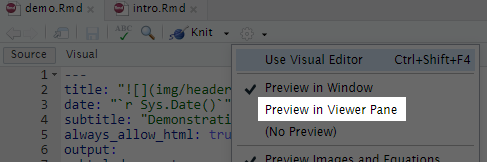

# {.tabset}
  
## Introduction
  
```{r pre-setup, message=FALSE, warning=FALSE, echo=F}
knitr::opts_chunk$set(echo = TRUE, warning = F, message = F)
install.packages(setdiff("pacman", rownames(installed.packages())))

library("pacman")

p_load(tidyr,readr,DiagrammeR,ggplot2,dplyr,lubridate,NHSRplotthedots,readxl,stringr,glue)

# avoiding tidyverse as loading in RStudio Cloud potentially runs out of memory 
```

Welcome to the first session of this introductory training in R and Rmarkdown. In this session, we will give an introduction to the tools that we'll use over the next three sessions. Some ground rules of this and the future training sessions:

1. The training is **interactive**. You'll be working on code, answering questions, and helping other trainees. Do please ask questions whenever you like, or for extra clarification if anything isn't as clear as you'd like it to be. 

2. Please leave **cameras and mics on** as much as you reasonably can. Social learning is a vital part of this training, and the more discussion and chat that we get, the better the sessions run.

3. Things will go wrong, and code will misbehave. **Be ready to share your screen when this happens.** The aim is that we will all collaborate on solving any problems that we might run into. This is the best way of developing a set of strategies for solving problems which is such an important part of the learning journey in this field.

### Exercise

Let's make an html page with the instructions for this session:

1. Select the *Knit to html* option from the menu at the top of the code pane. You can select any of the output formats, although I'd suggest sticking with .html (webpage) while working through the training.

```{r, echo=F, out.width = "400px", fig.align = 'center'}
knitr::include_graphics("img/knitr_options.png")
```

**or**

- press `ctrl+shift+k` while your cursor is in the code pane to knit to the last used format

2. You'll get a warning about required packages. Just agree to this, as you'll need the packages to knit your document properly.

```{r, echo=F, out.width = "400px", fig.align = 'center'}
knitr::include_graphics("img/packages.png")
```

3. Once you've had the document pop-up, try reknitting again (so step 1) after selecting the `Preview in viewer pane` option from the options menu at the top of the code pane. This will keep the output document in the viewer pane rather than in a pop-up:
   
```{r, echo=F, out.width = "400px", fig.align = 'center'}
 
```

## What will be be covering?

Let's look at the main parts of this training course. In today's session, we'll spend some time getting used to Posit Cloud, and explore some ways of making yourself at home in it. We'll then move on to introduce Rmarkdown. Rmarkdown is the way that we produce neatly-formatted text in these reports. So *this text*, the document headings, and most of the other material that you see in these materials is made in Rmarkdown.

Once we've introduced Rmarkdown, we'll then spend the next two sessions introducing R, and showing you how to work with data. For example, we'll load some data into R and tidy it:

```{r}
# this is a chunk of R code that loads some data, and converts the date format
data <- read_csv("data/data.csv") %>% 
  mutate(date=dmy(date))
```

We'll then use that data to produce dynamic text, that updates as the data changes, formatted using RMarkdown:
  
+ Our data is `r ncol(data)` columns by `r nrow(data)` rows
+ The column headings are **`r colnames(data)`**
+ The first date in our data is `r min(data$date)`, and the last date is `r max(data$date)`. 

We'll also learn how to manipulate and display data, including producing summaries and other measures of use across health, care, and housing:

```{r}
data %>%
  mutate(total = count1 + count2 + count3) %>%
  head() %>%
  knitr::kable(caption="Some vital data")
```

We'll draw graphs with that data and show how they can fit into your report:

```{r fig.height=1.5, fig.width=7, fig.align = 'center'}
data %>%
  ggplot() +
  geom_line(aes(x=date, y=count1)) +
  xlab("Date") + ylab("Count 1") +
  ggtitle("Some vital data over time") +
  theme(axis.text = element_text(size = 6), axis.title = element_text(size = 7))
```

Finally, we'll end with some tips on possible next steps for you.

### Exercise
Let's take a chunk of code that draws a graph. Can you find where the title of the graph is set? Can you tweak the title to improve it?

Once you've made your changes in the code below, try re-knitting your document using the *Knit to html* option from the menu at the top of the code pane (or *`ctrl+shift+k`*).

```{r fig.height=1.5, fig.width=7, fig.align = 'center'}
data %>%
  ggplot() +
  geom_line(aes(x=date, y=count2)) +
  xlab("Date") + ylab("Count 1") +
  ggtitle("More vital data over time") +
  theme(axis.text = element_text(size = 6), axis.title = element_text(size = 7))
```

## Making yourself at home in Posit Cloud 

### Exercise
Let's start by making Posit Cloud feel a bit less intimidating. Four things to try:

1. Look at the four panes. What's going on in each?

1. Have a look through the files pane to get a sense of how the project files fit together.

1. Use the minimize/maximise buttons (`r knitr::include_graphics("img/minmax.png")`) in the upper right-hand corners of the four panes to hide the `Console/Terminal/...` and `Environment/History/...` panes for now to simplify the view.

1. Try some of the appearance options in the global options menu (*Tools / Global Options*) - you could set a whole theme, change the size of the text in the interface, and lots of other tweaks


It's useful to try and switch between the code pane and the viewer pane to see how the report works. You might find it helpful to minimise the Console and Environment panes for this tutorial as they're less important at this stage. 

## Rmarkdown

[Rmarkdown](http://rmarkdown.rstudio.com) is a simple markup language. You might have used it before without really knowing what it was called. If you've ever posted on a Wordpress site or web forum with basic text formatting options available, the chances are that you've already done at least a tiny bit of markdown. Just to give you an example, surrounding a word with asterisks - like ```*italics*``` formats it in *italics*. Pairs of asterisks either side of the word formats that word - like ```**bold**``` - formats the text as **bold**. And so on. 

This kind of very basic formatting is known as Markdown. While it's simple, it's usually sufficient to allow the production of neat and clear documents that are easy to ready. Rmarkdown is just Markdown with a few extras to allow you to embed R code directly into the text that you're writing. That R code allows you to do more-or-less any data analysis that you might like and include the results in your markdown-formatted document. 

There's a quick reference, and a couple of exercises, at the foot of this section. But to give you an idea of what Rmarkdown can do, we can have a look at the static materials for this demonstration. Let's have a quick look at the Rmarkdown code for this training report now to see what it's like:

### Rmarkdown in this report

1. Try to find the Rmarkdown code corresponding to this text in the source code pane. We're currently at about line 80 in the source code. Once you've found this section, have a look around to spot:

+ a link
+ some bold text
+ a heading
+ some bullet-points

2. You'll also see that we were able to output this report in different formats. Now might be a good time to try knitting to one of the other formats available - like `.doc`, or `.pdf`. Note that the formatting is (broadly) the same, no matter what the output format. This can be a fantastic time-saver if you're manually producing both print and web versions of your reports now.

6. When you've finished looking at the Rmarkdown, move on to the exercises below

----
  
### RMarkdown quick reference

*italics*: ```*italics*```

**bold**: ```**bold**```

----
  
Add a horizontal break: ```----``` (so at least 4 dashes, with new lines either side)

----
  
[links](https://google.com): ```[links](https://google.com)```

Heading levels

```
# Level 1
## Level 2
### Level 3
...

- dashes at the start of lines make bullet-points
- like so
```
- dashes at the start of lines make bullet-points
- like so

```
1. Numbers at the start of lines make numbered lists
2. like so
```
1. Numbers at the start of lines make numbered lists
2. Like so

You can also add images easily in RMarkdown, and you can easily find [guidance online about how to do this](https://www.earthdatascience.org/courses/earth-analytics/document-your-science/add-images-to-rmarkdown-report/). I'd advise you not to use RMarkdown for image handling, because it can cause problems (particularly when you're using images hosted on the web) when you `knit` your project to .pdf and .docx formats. The R command `include_graphics()` is a much better option, and we'll cover its use in the graphs section.

----

### Exercises

1. Change THIS TEXT to bold, and THIS TEXT to italic

2. Add some bullet points below here describing your morning:
+ this morning, I...

Do have a look at the Rmarkdown in the code pane, and feel free to play around with it.

## Knitting

In this section, we're going to give a bit of explanation about something that we've already been doing: *knitting*. This is the way that we describe the translation process that takes our R/Rmarkdown code, and produces a suitable output format. We call that conversion *knitting* (after the R package `knitr` that manages the conversion).

### Exercise

Try knitting this document to each of the three formats in the knit menu.

In RStudio, you can select which output format you'd like your report to be rendered as:

```{r, echo=F, out.width = "400px", fig.align = 'center'}
knitr::include_graphics("img/knitr_options.png")
```

Try these different formats out now. I'd recommend sticking with html while you're working on a report, though, just because it tends to render most quickly, and plays nicely with other aspects of the workflow while you're writing.

### How does knitting work?

Knitting is controlled by the preamble at the head of our .Rmd file. Everything between the pair of three dashes: `---` is concerned with setting up this Rmarkdown document:
   
```{verbatim}
 ---
title: " Introductory R and Rmarkdown"
date: "`r Sys.Date()`"
subtitle: "Demonstration"
always_allow_html: true
output:
  html_document:
    toc: no
    toc_depth: 2
    number_sections: no
    toc_float:
      collapsed: no
word_document:
  toc: yes
  toc_depth: '2'
pdf_document:
  toc: yes
  toc_depth: '2'
  pandoc_args: ["--extract-media", "."]
---
```
 
Most of this header block is made up of options for the different output formats (html, word, and pdf).
 
This header block is written in YAML. You can find more information about [YAML editing in chapter 2 of the excellent R Markdown Cookbook](https://bookdown.org/yihui/rmarkdown-cookbook/rmarkdown-anatomy.html). Editing YAML can be a bit fiddly. For instance, indentation and white-space matters in YAML. Each of the three output formats (html_document, pdf_document, and word_document) are indented from the *output:* line, and each of the output format options are indented too. A common cause of documents not knitting (see below) are small errors in the indenting in the header.
 
One option is to ignore the YAML altogether, and use the default options that Rstudio provides. If you're trying to create a new Rmarkdown document, Posit Cloud gives you an simple header to get started. You can create a new Rmarkdown document in Rstudio by navigating to `File >> New file >> R Markdown...`.

### Exercise

Try this out now, and create a new Rmarkdown document from the menu.

----

Alternatively, and perfectly honourably, you can copy the header from this document, and paste it at the top of your document, and make minor tweaks to suit. For example, I've added a link to the KIND Learning Network banner image as part of the title. If you're thinking about adapting this report to suit your purposes, you can easily change that by editing the URL in the following line:

```{verbatim}
title: " Introductory R and Rmarkdown"
```

You might notice another tweak that I've made to the pdf output options for this document, which is to add the line:

```{verbatim}
pandoc_args: ["--extract-media", "."]
```
 
This simplifies some of the image handling in this document to allow pandoc (that writes the .pdf version of the report) to download the linked images so that they are properly incorporated in the text.
 
### knitr / R chunks
 
One last important point about Rmarkdown: we need to tell Posit Cloud where our Rmarkdown ends, and our R code begins. We do this using code chunks. Code chunks in Rmarkdown start and end with a triple backtick:
   
`r knitr::include_graphics("img/backs.png")`
 
If you look at the code pane, you'll see that most of our R commands are wrapped-up in triple backticks, with a lot of options in {curly brackets}. These backticks are the way that we mark our R code, thus telling RStudio Cloud to interpret it as R, rather than RMarkdown. We call these sections of code ```chunks```. In what's ahead, one of the most common problems come from chunks, and so one of the first things to check if a command doesn't work as expected is that it's properly in place in a chunk.
 
If you're new to R you might not ever have used the backtick (`` `r '\x60'` ``) key before. You can usually find it at the extreme top left of most keyboards, often below the `Escape` key. Backticks are definitely different from the apostrophe ('), and it's vitally important to not get the two confused when you're working with R.

<!-- Please ignore the horrible messing about with \x60r etc that I've done in the paragraph above to get backticks to display properly in RMarkdown. This isn't something that you're likely to have to do - unless you end up writing your own RMarkdown tutorial at some point in the future...-->

Apart from the backticks and the R code itself, there are also some options in {curly brackets} at the head of some of the chunks. We won't run through all of these during the session, but it's likely that we'll do a little bit of playing around with them if our code misbehaves. So, for reference, the most useful code chunk options are:
  
+ `r`: telling Rmarkdown to interpret this code as R. There are other languages that you can use in Rmarkdown, which is one of the strengths of building reports in this way.
+ `setup`: the chunk label. This can be anything you like, but no duplicates are allowed. Very useful for navigation in more complicated reports
+ `echo=TRUE`: whether to show this code in the report. If this is set to FALSE, you'll just see the output of the code (more on this below)
+ `eval=TRUE`: whether or not to run the code. If eval=FALSE, the code won't do anything other than appear in the report (useful if you're explaining how something works - like this report!)
+ `warning = FALSE`: whether to show warnings in the report if something goes wrong with your code
+ `message=FALSE`: whether to show information messages about how your code is running
+ we've also explored some options relating to image size and alignment in the graph section, such as  `out.width = "400px"`, and `fig.align = 'center'`

Setting all the chunk options can become very involved. The [Rmarkdown Cookbook](https://bookdown.org/yihui/rmarkdown/r-code.html) is a great helper and reference for that kind of work. In general, it's best to keep them as simple as possible. You might just begin with default chunks. A useful shortcut to insert a new R chunk is `ctrl + alt + i`, or you can use the button at the top right of the code pane `r knitr::include_graphics("img/chunk.png")`, and only add the options as you need them.

There are also some useful hints in the [knitr documentation](https://yihui.org/knitr/options/). But for now, I'll suggest that you skip trying to figure it all out in favour of spending our time on some of the more interesting areas of this training. 

### Exercise
1. Create a new code chunk now, and adjust some of the options using the chunk options menu: `r knitr::include_graphics("img/chunk_opts.png")`

2. Once you've created your new chunk, add the following code to it:
```{verbatim}
data %>% 
  mutate(total=count1+count2+count3) %>%
  ggplot() +
  geom_col(aes(x=date, y=total, fill=count1))

```

3. Now re-knit your document to see your results. You can go back and tweak your chunk options if you're not happy with the appearance of your result.


