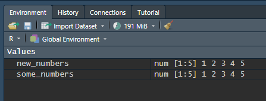

  
# {.tabset}

```{r pre-setup, message=FALSE, warning=FALSE, echo=F}
knitr::opts_chunk$set(echo = TRUE, warning = F, message = F)
install.packages(setdiff("pacman", rownames(installed.packages())))

library("pacman")

p_load(tidyr,readr,DiagrammeR,ggplot2,dplyr,lubridate,NHSRplotthedots,readxl,stringr,glue)

# avoiding tidyverse as loading in RStudio Cloud potentially runs out of memory 
```
## Introduction

Welcome to the second session of this introductory training in R and Rmarkdown. In this session, we'll give a quick introduction to R. A reminder of the ground rules for this session:

1. The training is **interactive**. You'll be working on code, answering questions, and helping other trainees. Do please ask questions whenever you like, or for extra clarification if anything isn't as clear as you'd like it to be. 

2. Please leave **cameras and mics on** as much as you reasonably can. Social learning is a vital part of this training, and the more discussion and chat that we get, the better the sessions run.

3. Things will go wrong, and code will misbehave. **Be ready to share your screen when this happens.** The aim is that we will all collaborate on solving any problems that we might run into. This is the best way of developing a set of strategies for solving problems which is such an important part of the learning journey in this field. We'll probably do more screen sharing today than in any of the other sessions.

This session is written for those without prior programming experience, and it concentrates on demonstrating how the main building blocks of R code work. The aim of this session is to help you develop your skills in reading and writing R code. These building blocks are:

1. Functions
2. Assigning to variables
3. Brackets
4. The pipe (`%>%` or `|>`)

Once we've introduced these building blocks, we'll go on to use them to load some data into R, and then tidy that data so that we can analyse it during the next training session. We will also introduce some of the technical terms used to describe code in R with the intention of making some of the useful online sources of help (such as [stack overflow](https://stackoverflow.com/questions/tagged/r)) more accessible and useful.

### Exercise

Here's a chunk of R code. By the end of this session, you'll have a much clearer idea of the various parts of this code, and how the parts fit together. For now, though, let's try and work out what the various parts of the code do. We'll pause the session for a minute to let you think about it, and then we'll have a group discussion about the parts of this code:

```{r eval=F}
data <- read_csv("data/data.csv") %>% 
  mutate(date = dmy(date)) 
```

## Building R code{.tabset}

### Functions

R is a *functional* programming language. That means that the basic unit of work in R is done by applying *functions* to things. Let's demonstrate this now using the `sum()` function. `sum()` gives us the total of some group of numbers: 

```{r}
sum(1,2,3,4,5)
```
In the work that we'll do in this training, we will be using lots of different functions. However, the way that we'll use each of them is broadly the same. Each function is a bit like a verb, describing what we want our code to do. We then describe what we want that verb to act on in the brackets after the function: so approximately `verb(noun)`.

In the code above, we were asking `sum()` to give us the total of the group of numbers in the brackets. Those numbers are our noun that the verb (`sum()`) will act on. 

To show the result, of your code, you need to run it. There are two ways that we'll introduce now, and explain later. The first, and easiest, is to press *ctrl+enter* while your cursor is somewhere on the line of code that you want to run. The alternative is to press the small green button at the right-hand side of the section of code that you're working on `r knitr::include_graphics("img/run_chunk.png")`

#### Exercise

Above, we found the total of the numbers 1-5. Can you find the total of the numbers 10-15 by updating the code below?

```{r}
# write your code below
sum(1,2,3,4,5)
```

`mean()` is a function that works like `sum()`. If you give it some numbers in the brackets, it will give you the average of those numbers. Can you update the code below so that we get the average of the numbers, rather than the total?

```{r}
# write your code below
sum(1,2,3,4,5)
```

----

### Variables
Now that you've had a chance to try a function for yourself, it's time to move on to another R building-block. We can put lots of different things in a function's brackets. For example, we can save some numbers, and pass those saved numbers on to `sum()`:

```{r}
some_numbers <- c(1,2,3,4,5)
sum(some_numbers)
```
That's useful because we can then re-use that list of numbers in other places:

```{r}
mean(some_numbers)
```

We call names like `some_numbers` *variables*. Variables are our second R building-block. We name variables using the *assignment operator* `<-`. You can name variables any combination of letters and numbers that you like, as long as you follow a couple of simple rules:

+ no numbers at the start of the variable name - so `12345_numbers` won't work
+ no underscores (`_`) at the start of the variable name - so `_numbers` won't work either
+ prefer using CamelCase or snake_case so that your names are clear and easy to read

#### Exercise

Can you give our group of numbers a more interesting and descriptive name than `some_numbers`? Update the code below:

```{r}
# write your code below
some_numbers <- c(1,2,3,4,5)
```

Now try using `sum()` to give the total of your newly-named group of numbers;
```{r}
# write your code below

```

----

We can also change the name of objects by just assigning them a new name:

```{r}
new_numbers <- some_numbers
```

You can keep track of this using the *Environment* pane, in the top-right hand corner. 

```{r echo=F}

```

As well as the preview of the contents that you get in the *Environment* pane, you can see what's inside a variable in R by just typing the name:

```{r}
some_numbers
```

And you can see all the variables that are in the environment using `ls()`:

```{r}
ls()
```
### Brackets

Our third R building block is the bracket. We've already been using brackets to distinguish between functions (followed by brackets) and other objects (generally within brackets). But we also use brackets to structure our code. For example, in the three examples below, the brackets change the order of operations. That means that we get different results from each version of the code:

```{r}
# adds 5 to each number in some_numbers
some_numbers + 5

# adds 5 to each number in some_numbers, and then sums the result
sum(some_numbers + 5)

# sums some_numbers, and then adds 5 to the result
sum(some_numbers) + 5
```
As we go on to write more complicated R code, you'll often see us nest one function inside the brackets of another. For example:

```{r}
round(mean(cumsum(some_numbers * 1.3)))
```

This nests several functions together, so we'll break down step-by-step to show you how to read this kind of code:

1. `some_numbers * 1.3` multiplies each number stored in the `some_numbers` variable by 1.3

```{r}
some_numbers * 1.3
```

2. Next, `cumsum()` generates a cumulative sum of that result:
```{r}
cumsum(some_numbers * 1.3)
```
3. We then take the average of those numbers using `mean()`:
```{r}
mean(cumsum(some_numbers * 1.3))
```

4. Finally, we round that answer to the nearest whole number using `round()`:

```{r}
round(mean(cumsum(some_numbers * 1.3)),0)
```

Be sure to keep a careful eye on the brackets - they need to match up, so that every **(** has a corresponding **)**, and it's very easy to inadvertently add an extra one. If you do this, R will fall over and print a cross-looking error message in the console pane. If this happens, don't worry too much - these kinds of error are usually easy to fix.

### The pipe
` %>%` - also called [the pipe](https://r4ds.had.co.nz/pipes.html) - is a way of chaining commands together. As we've seen above, nesting several functions together with brackets can get quite messy. We can use the pipe to simplify our code to do many operations in sequence on some set of data. One important fact to know: the pipe doesn't work in all R code. To explain why, we need to digress a bit into how R works.

#### Packages
R uses packages, which are plug-ins that offer useful functions. We need to add these packages to R to help us do some of our tasks. We've actually added them already in the first few lines of this report. Let's have a look at this code, which here includes some explanatory comments:

```{verbatim}
# if pacman is missing, installs pacman, which helps us manage packages
install.packages(setdiff("pacman", rownames(installed.packages())))

# loads pacman
library("pacman")

#loads required packages
p_load(tidyr,readr,DiagrammeR,ggplot2,dplyr,lubridate,NHSRplotthedots,readxl, stringr)

# Comments are useful - add comments as you work! R comments start with a #, comments in RMarkdown start <!-- and end -->

```

This chunk of code loads several packages here to help us do some useful work with our data. These are all *very* useful for health and care projects, so we'll briefly introduce them here:

+ [tidyverse](https://www.tidyverse.org/) - this is a large ecosystem of tools designed for data science. Specifically in this training session, we use tidyr, readr, DiagrammeR, ggplot2, stringr, readxl, and dplyr.
+ [lubridate](https://lubridate.tidyverse.org/) - helps with handling dates and times
+ [NHSRplotthedots](https://github.com/nhs-r-community/NHSRplotthedots) - NHS-R community tool for making XmR charts

There's a lot that might be said about packages here, but this is probably better skipped over for now. If you're very interested, the [NHS-R statement on tools](https://nhs-r-community.github.io/statements-on-tools/statement-on-using-tools.html) has some useful background information about packages and their role in making R work.

#### Back to the pipe
**The pipe only works in [tidyverse](https://www.tidyverse.org/) functions**. Let's demonstrate the pipe by showing it at work in some code that will load data into R, and tidy it up for us:

```{r eval=F}
data <- read_csv("data/data.csv") %>%
  mutate(dates = dmy(dates)) %>%
  mutate(total = count1+count2+count3)
```

We'll explain the functions in this code in the next section, but for now, let's concentrate on the pipe. The pipe (`%>%`) allows us to stick lines of code together. In the example above, we do three different operations - reading some data, then fixing the dates in the data, then making a new summary column. In traditional R, we would need to either nest those functions together in a long string of nested brackets, or save our data each time using `<-`. However, the pipe lets us do each of the three operations in series. It has some other important properties too that we'll cover later on, but for now we can happily think of the pipe as a way of joining sections of code.

Note that in very new R code, you might also see an alternative way of writing the pipe as `|>`. We take quite a conservative approach to innovations in code in this training so that we don't exclude trainees who are working from older systems, and so we'll stick with the traditional formulation of the pipe for now.

## Getting data

It's time to start thinking about the data that we are going to use in our Rmarkdown report. Luckily, getting data into R is easy. Instead of opening a data file directly (as we might when using Excel), and then inspecting and analysing it, we instead load all the data in that file into R. 

There is some demo data available in the file pane, under the `data` folder. All of the data files here are pretty simple, and follow roughly the same pattern: they give three different values each measured on a single date as shown below. This might be similar to the kind of data that you'd see in your work - like admissions figures, service engagement statistics, or inquiry measures.

| date       | count1 | count2 | count3 |
| ---------- |:------:|:------:|:------:|
| 01/05/2022 |   11   |   93   |   82   |
| 02/05/2022 |   15   |   114  |   99   | 
| 03/05/2022 |   ...  |   ...  |   ...  |

We load the data from the first of these data files (`data.csv`) using the following function:

```{r}

data <- read_csv("data/data.csv")

```

We should definitely pause here to explain this code:

+ `read_csv` is the main function, which opens a .csv data file, and reads its contents
+ `data/data.csv` is where we tell `read_csv` which .csv file to open by specifying the filename and path
+ `<-` then assigns the data that `read_csv` pulls out of the file to...
+ `data` - the *tibble* that contains our data. We'll explain what a tibble is below, but for now you can just think of it as the way that R stores data

Because there are lots of different types of data out there, there are lots of ways of loading data into R. ```read_csv``` is the most commonly-used function, because .csv files - **c**omma **s**eparated **v**alues - are widely used to share data. The other main function used to load data is readr's ```read_excel```, which works similarly to ```read_csv```. 

Let's try a couple of exercises now to help you get up to speed with reading data. There are two empty R chunks below. Can you fill in the gaps to make the right thing happen?

### Data exercise 1
Can you load the data from the data.csv file into a tibble called ```data2```?

```{r}
# Can you load the data from the data.csv file into a tibble called ```data2```?

# Write your code below. Hint: the structure of the command will be the same as the chunk above - which went:

data <- read_csv("data/data.csv")

# but the name of the tibble will be different this time. You can check to see whether your code has worked by un-commenting the line below:

# head(data2)

```

### Data exercise 2
Now we want to load some data from a different file. That file uses a different format - it's an Excel (.xlsx) file, rather than a .csv. Can you load the data from the data/data2.xlsx file into the ```data2``` tibble. You'll need to use `read_excel` rather than `read_csv`?

```{r}
# Can you load the data from the data/data2.xlsx file into the ```data2``` tibble using read_excel?

# Write your code below. This will overwrite the contents of data2 with new data. Again, the previous line of R code is provided as a guide: but you'll need to change the command itself, and the name of the data file the command loads.

data2 <- read_csv("data/data.csv")

# Hint: whenever you're in a chunk, you can get help on a command by typing a question mark, then the name of the command, then ctrl-enter. For example, you can type ?read_excel on a new line for help with reading .xlsx files.
```

Again, we can use `head()` to inspect the first few rows:

```{r inspect data 1, echo=TRUE, eval=TRUE, warning = FALSE, message=FALSE}
head(data2)
```

### Data exercise 3
Can you look at the head of your `data2` tibble? How do `data` and `data2` differ?

```{r}
# Can you look at the head of your `data2` tibble? How do data and data2 differ?

# Write your code in the line below. Again, here's the previous command as a starting point:

head(data)

```

### A note on tibbles
From the .csv file, we have converted the data into a *tibble*, which is the name for the data structure used by the package `tidyverse`. In this tibble (called `data`), each row contains four columns. One holds date, and the remaining three hold of counts of some imagined values from those dates. 

There's potentially lots to say about tibbles. If this is new territory for you, the [relevant chapter in *R for Data Science*](https://r4ds.had.co.nz/tibbles.html) is a great place to start. Or if you'd prefer something much more terse, the high-level introduction on the [tidyverse site](https://tibble.tidyverse.org/) would be good too.

### Back to our data

Once we've loaded our data, we can begin to do all kinds of interesting things with it. Most of that will have to wait for next session - we'll need to do some data tidying first before we can do most of the really interesting work. But just to whet your appetite, here are a couple of examples of operations that we can do on our data.

A common finding that we often need to report in data-driven work is about length. Just how many dates do we have data for? Happily, this is one of the easiest things to discover using R, because we can count the total number of rows in our tibble using the the `nrow()` command:

```{r}
nrow(data)
```
### Data exercise 4
Does `data2` have the same number of rows as `data`?

```{r}
# Does `data2` have the same number of rows as `data`?

# Write your code in the line below

```


Or we can pull out the column headings with:
```{r}
colnames(data)
```

### Data exercise 5
Again, does `data2` have the same column headings as `data`?

```{r}
# Does `data2` have the same column headings as `data`?
# Write your code in the line below

```
Note that in the couple of examples above, we've just asked R to show us the number of rows, and the column names. We can also save these findings, which we might do if we want to use them later for another purpose. Just for instance, we can make a new variable *data_length* containing the number of rows in our data with:

```{r}
data_length <- nrow(data)
```

And we can refer back to the value of *data_length* whenever we like:
```{r}
data_length
```

Or do things to that value - like multiplying it by five:
```{r}
data_length * 5
```

### Data exercise 6
Can you calculate and display the difference in length between `data` and `data2`?

```{r}
# Calculate and display the difference in length between `data` and `data2`?
# Write your code in the line below

```

We can also create new variables from more complicated operations on our original tibble. For instance, we can extract a whole column using the shorthand `tibble$column`, and then add all the entries in that variable together using ```sum()```:

```{r}
sum_count3 <- sum(data$count3)
sum_count3
```
I think that's enough demonstrating the basics of loading data for now, and so we'll move on to tidying data.

## Cleaning data

There's one important problem with our `data` tibble: our dates aren't proper dates yet. `read_csv` doesn't know that the values in the date column actually are dates. We can tell that by looking at `head(data)`, which shows that the type of data in the `date` column is `<<chr>>`. This stands for `character`, which is the way that R refers to text values. We definitely want those values to be stored properly as dates, and doing that conversion will be the next part of this session
 
Time for another R chunk:

```{r}

data_dates <- data %>% 
  mutate(date = dmy(date))

```

There's a bit to unpack here. Personally, it makes most sense to read this code backwards. From right to left, then:

+ ```dmy(date)``` is a lubridate command which takes whatever is inside the bracket, and tries to convert it into a proper date. It works by assuming that it'll be a day value (d), followed by a month (m), followed by a year (y). There are also related commands like ```ymd()``` to be used when the dates given in our data are formatted differently.
+ `mutate(date =...)` takes the result of the `dmy()` above, and uses it in a command named `mutate`. `mutate` makes new columns in tibbles from existing columns. Here, we tell `mutate` to make a new column called `date` by taking the result of the `dmy(date)` above.
+ `data %>% mutate...` pipes the contents of the `data` tibble into the mutate function
+ finally, we assign the modified data tibble to a new tibble `data_dates` using `<-`.

### Exercise

Let's take our `data_2` tibble, and inspect its `head()` to see what type of data is stored in it to find out whether or not we'll need to modify the date column in the same way:

```{r}
# write your code below
head(data_dates)
```

### Other major clean-ups

#### Missing and incorrect data

Sometimes we'll have missing or anomalous data in the files that we load into R. This can cause all kinds of subtle problems in R. Our `data` tibble (and derivatives like `data_dates` etc) have no missing data, so to demonstrate we'll load some new, faulty data into `data3`, and try to tidy it up. The first part of this should be very familiar - we load data using `read_csv()`, then mutate the date column to give us proper dates. We then look at the `head()` of the data:

```{r}
data3 <- read_csv("data/data3.csv") %>%
  mutate(date = dmy(date)) 

head(data3)
```
Right away we can see a few problems:

- there's missing data in the count1 column (`NA`)
- the count2 column is `<chr>`, rather than `<dbl>` - *double* is R's way of referring to numeric data
- the title of the last column seems to have gotten scrambled

Let's deal with the missing data. Let's see what we're dealing with by using the `filter()` command. Filter looks through tibbles, and returns any that match the conditions you specify. So to look at the date column of `data` we would write:

```{r}
data3 %>% 
  filter(is.na(date))
```

We can look at each column in the same way. 

##### Exercise

Use `filter()` to look at the other columns of `data`. You can use the code above as a template:

```{r}
data3 %>% 
  filter(is.na(date))
```

----

```{r echo=F, eval=F}
# here's a variant that looks through all the columns at once. Don't worry too much about the details of this code. We tell `filter` to look across the date, count1, count2, and count3 columns using `if_any`, and then specify that `filter` should look for any rows with missing data using `is.na`.

data3 %>% 
  filter(if_any(c(date, count1, count2, cnont3), ~ is.na(.)))

```

#### Renaming columns
Let's change that `cnont3` into something more seemly - like `count3`. I'll give you some tips, and then leave you to do the actual renaming as an exercise. We'll use the command `rename()` to do the renaming. It's a pretty simple command, so rather than explain it fully, let me refer you to the [manual page](https://dplyr.tidyverse.org/reference/rename.html) - or you can run `?rename()` in the R chunk below:


```{r}
# Add your code below - I've included head(data3) afterwards so that you can check the renaming has worked properly.


head(data3)
```
Now that we have some data loaded and cleaned up, we're ready to use it to start writing our report.